# Lab 01: Wireshark Packet Capture and Filtering Basics

> **Lab Folder:** `labs/lab-01-wireshark-packet-filtering`

---

## Objective

The goal of this lab was to get started with Wireshark, capture live network traffic on a local interface, understand the packet details shown in the packet list pane, and practice using display filters and logical operators to isolate specific traffic.

---

## 1. Starting a Packet Capture

### Step 1: Select the Network Adapter
Open Wireshark and choose the active network interface. In this case, I selected the Wi-Fi adapter.

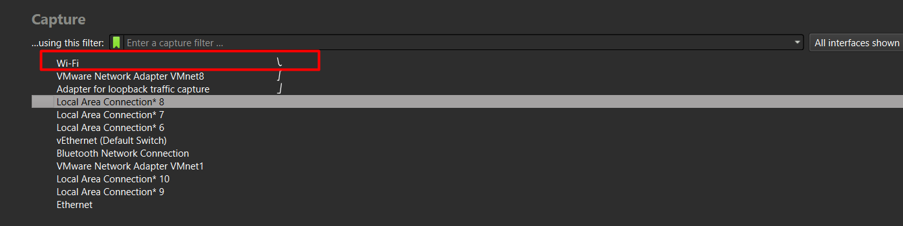

### Step 2: Start Capturing
Click the blue shark fin icon in the top toolbar to begin capturing packets from the selected interface.

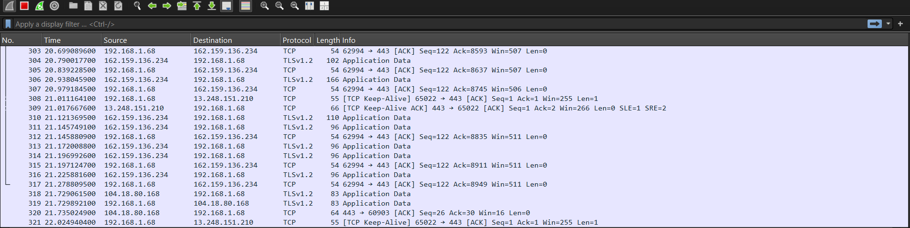

### Step 3: Stop and Inspect Traffic
After running the capture for a short period, stop the capture by clicking the red stop button. A high volume of packets is collected across different protocols and background processes.

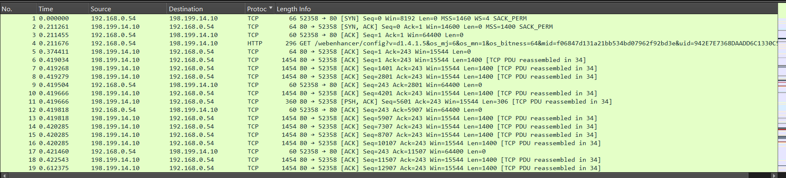

---

## 2. Understanding the Packet List Columns

At the top of the packet list pane, Wireshark displays several standard columns for each packet:

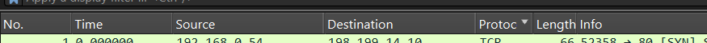

- **No.**: The sequential packet number from the start of the capture session (packet 1 to the last packet captured).
- **Time**: The timestamp showing when the packet was captured relative to the start of the capture.
- **Source (src)**: The IP address (IPv4 or IPv6) or MAC address of the device sending the packet.
- **Destination (dst)**: The destination address receiving the packet.
- **Protocol**: The higher-level protocol detected in the packet. Common examples observed:
  - **HTTP** (Hypertext Transfer Protocol)
    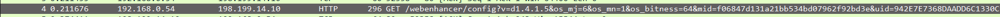
  - **TCP** (Transmission Control Protocol)
    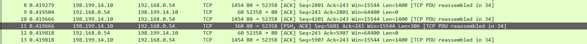
  - **UDP** (User Datagram Protocol)
    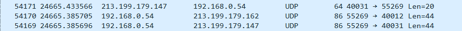
- **Length**: The total size of the packet in bytes.
- **Info**: A summary of the packet contents and purpose (e.g. TCP flags, sequence/ack numbers, HTTP request URI, or DNS queries).

---

## 3. Filtering Packets

During a live capture, thousands of packets are recorded within seconds, making it difficult to find specific traffic manually. Wireshark display filters allow isolating only the relevant packets based on IP addresses, ports, protocols, or packet flags.

### Host and IP Filters

#### Filter by Host IP (`ip.addr`)
Locates all packets where the specified IP address appears as either the source or destination.

```text
ip.addr == 192.168.0.54
```

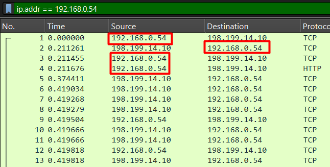

#### Filter by Source IP (`ip.src`)
Matches packets originating only from the specified source IP address.

```text
ip.src == 192.168.0.54
```

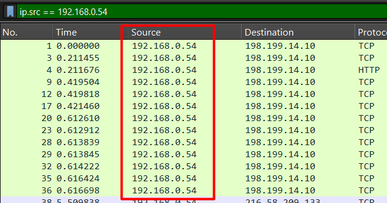

#### Filter by Destination IP (`ip.dst`)
Matches packets addressed only to the specified destination IP address.

```text
ip.dst == 192.168.0.54
```

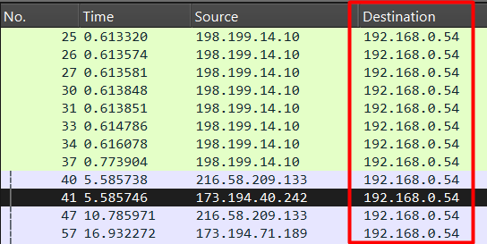

---

### Port and Hardware Filters

#### Filter by TCP Port (`tcp.port`)
Filters traffic using a specific TCP port. For example, standard HTTP web traffic uses port 80.

```text
tcp.port == 80
```

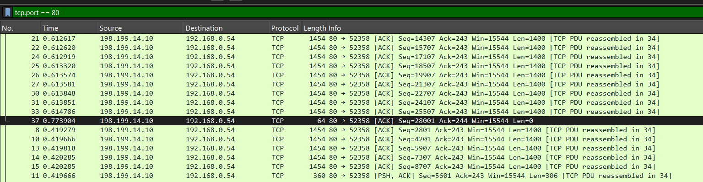

#### Filter by UDP Port (`udp.port`)
Filters traffic using a specific UDP port.

```text
udp.port == 80
```

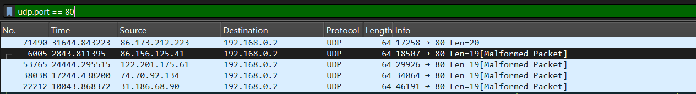

#### Filter by MAC Address (`eth.addr`)
Filters based on the Layer 2 hardware (MAC) address regardless of whether it is source or destination.

```text
eth.addr == 78:54:2e:9f:10:28
```

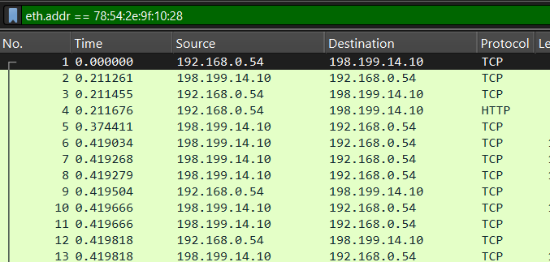

*Note: `eth.src` and `eth.dst` can also be used to filter specifically by source MAC or destination MAC.*

#### Filter by Frame Timestamp (`frame.time`)
Filters packets based on the time they arrived.

```text
frame.time
```

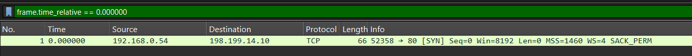

#### Filter by TCP Flags (`tcp.flags`)
Filters packets based on TCP control flags, such as identifying ACK or SYN packets.

```text
tcp.flags.ack == 1
```

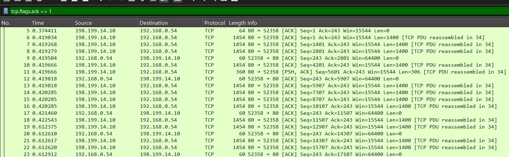

---

## 4. Logical Operators

Multiple display filters can be combined using logical operators to narrow down traffic more precisely:

| Operator | Syntax | Description |
|---|---|---|
| AND | `and` or `&&` | All conditions must be true |
| OR | `or` or `||` | At least one condition must be true |
| XOR | `xor` or `^^` | Exactly one condition must be true, not both |
| NOT | `not` or `!` | The condition must NOT match |

### Examples

#### Using AND (`and` / `&&`)
Filters for traffic where both the source and destination IP match simultaneously:

```text
ip.src == 198.199.14.10 and ip.dst == 192.168.0.54
```

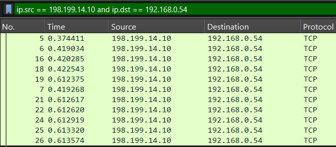

#### Using OR (`or` / `||`)
Filters for packets where either condition matches:

```text
ip.src == 198.199.14.10 or ip.src == 192.168.0.54
```

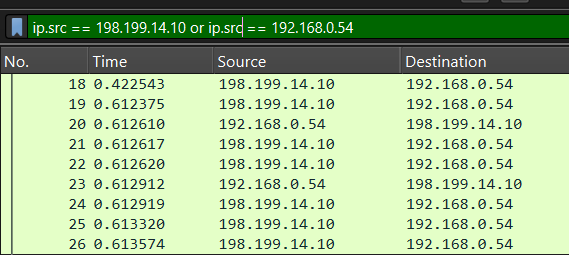

#### Using NOT (`not` / `!`)
Excludes specific protocols or addresses from the view (for example, showing all traffic except UDP):

```text
not udp
```

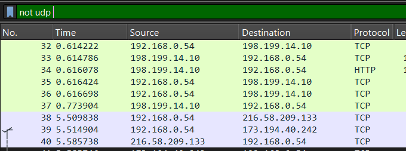

---

## Summary and Takeaways

- Starting a capture on the correct active network adapter is required to observe live local communications.
- The packet list provides essential metadata (packet index, timestamp, source/destination addressing, protocol, and payload info).
- Display filters significantly reduce capture clutter, allowing quick isolation of traffic by IP address, port, MAC, or protocol flags.
- Logical operators (`and`, `or`, `not`) enable compound filters for targeted packet analysis.