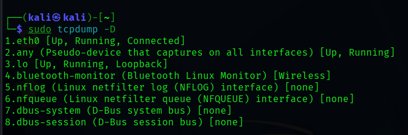
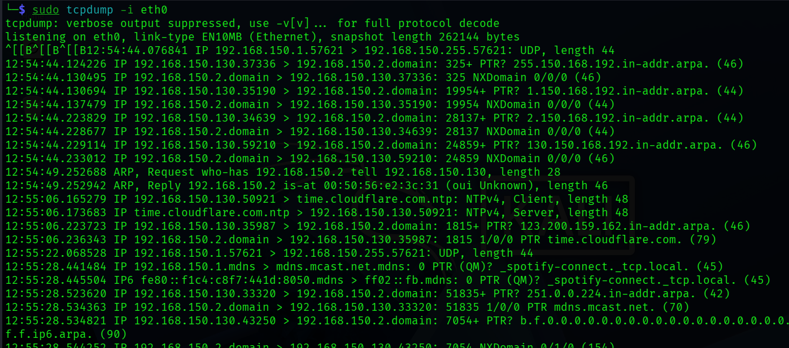
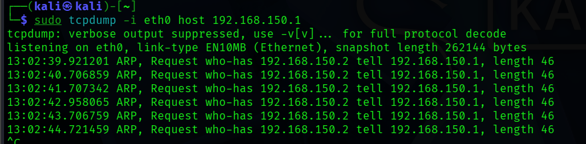
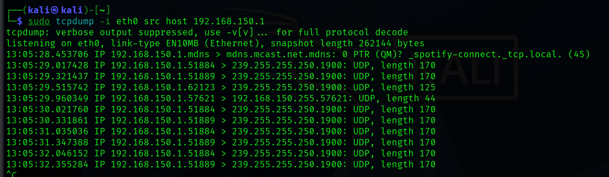
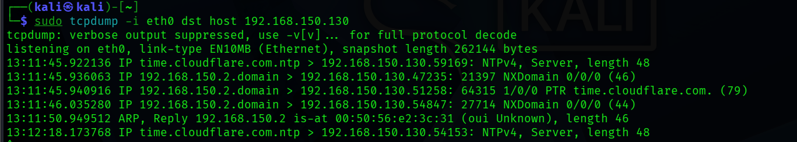
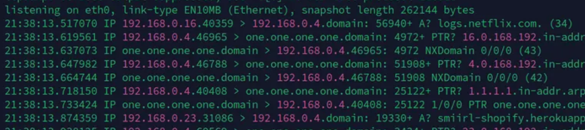

# Lab 02: Command-Line Traffic Capture and Filtering with tcpdump

> **Lab Folder:** `labs/lab-02-tcpdump-packet-capture-and-filtering`

---

## Objective

The objective of this lab was to capture and inspect live network traffic from the Linux command line using **tcpdump**. While Wireshark provides a graphical interface for deep inspection, tcpdump is essential for remote servers, headless environments, and fast command-line diagnostics without GUI overhead.

This lab covers:
- Identifying active network interfaces
- Initiating live captures on a selected interface
- Interpreting tcpdump packet output syntax
- Using Berkeley Packet Filters (BPF) to filter traffic by host IP, source IP, destination IP, and port numbers

---

## 1. Discovering Network Interfaces

Before starting a packet capture, you need to identify which network interfaces are available on the system.

### Command:
```bash
sudo tcpdump -D
```

The `-D` flag lists all network interfaces that tcpdump can listen on:



### Observed Interfaces:
1. `eth0`: Primary Ethernet interface (marked as Up, Running, Connected).
2. `any`: Pseudo-device that captures traffic across all active interfaces simultaneously.
3. `lo`: Loopback interface for local inter-process communication.
4. Additional virtual and subsystem interfaces (`bluetooth-monitor`, `nflog`, `nfqueue`, `dbus-system`, `dbus-session`).

---

## 2. Capturing Live Traffic on an Interface

Based on the interface list, `eth0` was selected as the active interface for capturing live network packets.

### Command:
```bash
sudo tcpdump -i eth0
```

The `-i` flag specifies the target interface.



To stop a live capture session at any time, press `CTRL + C`. Upon interruption, tcpdump outputs a summary showing total packets captured, received by filter, and dropped by kernel.

---

## 3. Anatomy of a tcpdump Output Line

When running tcpdump, each captured packet is printed as a structured text line:

```text
12:54:44.130495 IP 192.168.150.2.domain > 192.168.150.130.37336: 325 NXDomain 0/0/0 (46)
```

Each component provides specific details about the packet:

| Field | Description | Example from Capture |
|---|---|---|
| **Timestamp** | The exact time the packet was captured (HH:MM:SS.microseconds) | `12:54:44.130495` |
| **Network Layer** | The network layer protocol (IPv4 or IPv6) | `IP` |
| **Source** | The sender IP address and source port/service name | `192.168.150.2.domain` |
| **Direction** | Indicates packet flow direction (`>`) | `>` |
| **Destination** | The receiver IP address and destination port | `192.168.150.130.37336` |
| **Protocol / Flags** | Transport protocol details, DNS queries/responses, or TCP flags | `325 NXDomain 0/0/0` |
| **Packet Length** | Size of the packet payload in bytes | `(46)` |

### Common TCP Flags in tcpdump:
In TCP traffic, tcpdump represents control flags between brackets:
- `[S]`: SYN (Connection initiation)
- `[.]`: ACK (Acknowledgment)
- `[S.]`: SYN-ACK (Connection acceptance)
- `[P]`: PUSH (Data transmission to application)
- `[F]`: FIN (Graceful connection teardown)
- `[R]`: RST (Connection reset)

---

## 4. Packet Filtering with Berkeley Packet Filters (BPF)

Live captures on busy interfaces quickly generate overwhelming amounts of text. Using Berkeley Packet Filters (BPF), traffic can be filtered at the kernel level so only relevant packets are processed.

### 4.1 Filter by IP Address (`host`)
To capture all packets involving a specific IP address regardless of whether it is the source or destination:

```bash
sudo tcpdump -i eth0 host 192.168.150.1
```



This command filters strictly for packets where `192.168.150.1` is either the sender or receiver. In the capture, ARP requests (`who-has 192.168.150.2 tell 192.168.150.1`) are isolated cleanly.

---

### 4.2 Filter by Source IP (`src host`)
To isolate traffic originating only from a specific host:

```bash
sudo tcpdump -i eth0 src host 192.168.150.1
```



This restricts output so that `192.168.150.1` must be the sending address. In this test, outbound UDP multicast packets (such as SSDP/mDNS service discovery to `239.255.255.250`) are captured.

---

### 4.3 Filter by Destination IP (`dst host`)
To monitor traffic traveling to a specific target address:

```bash
sudo tcpdump -i eth0 dst host 192.168.150.130
```



This isolates incoming packets addressed specifically to `192.168.150.130`, capturing inbound NTP time synchronization packets and DNS responses.

---

### 4.4 Filter by Port (`port`)
To monitor traffic associated with a specific port and protocol, specify the protocol (`tcp` or `udp`) followed by `port` and the port number:

```bash
sudo tcpdump -i eth0 tcp port 80
```



This isolates all HTTP web traffic operating over TCP port 80. Similarly, DNS traffic can be inspected with `udp port 53`, and secure web traffic with `tcp port 443`.

---

## 5. Useful tcpdump Options and Flags

In addition to filtering expressions, several command-line flags improve readability and workflow:

| Flag | Purpose | Example |
|---|---|---|
| `-i <interface>` | Specify interface to capture on | `sudo tcpdump -i eth0` |
| `-n` | Do not resolve IP addresses to hostnames (faster, clearer numerical IPs) | `sudo tcpdump -i eth0 -n` |
| `-nn` | Do not resolve hostnames or port names (shows port numbers like 80 instead of http) | `sudo tcpdump -i eth0 -nn` |
| `-c <count>` | Automatically exit after capturing a set number of packets | `sudo tcpdump -i eth0 -c 20` |
| `-v` / `-vv` | Increase decoding verbosity (shows TTL, IP ID, TOS, and options) | `sudo tcpdump -i eth0 -v` |
| `-X` | Display packet data in both hexadecimal and ASCII | `sudo tcpdump -i eth0 -X port 80` |
| `-w <file.pcap>` | Save raw packets directly to a PCAP file for analysis in Wireshark | `sudo tcpdump -i eth0 -w capture.pcap` |
| `-r <file.pcap>` | Read and analyze an existing PCAP file from disk | `sudo tcpdump -r capture.pcap` |

---

## 6. Combining Filters with Logical Operators

Just as in Wireshark, BPF expressions can be combined using logical operators:
- **`and` (or `&&`)**: Both conditions must match.
  - Example: `sudo tcpdump -i eth0 src host 192.168.150.1 and tcp port 80`
- **`or` (or `||`)**: At least one condition must match.
  - Example: `sudo tcpdump -i eth0 port 80 or port 443`
- **`not` (or `!`)**: Exclude matching packets.
  - Example: `sudo tcpdump -i eth0 not port 22` (useful when capturing over SSH without logging your own connection)

---

## Summary and Takeaways

- `sudo tcpdump -D` provides a quick overview of all interfaces available for capture.
- Capturing with `-i <interface>` logs live network events directly to the terminal; pressing `CTRL + C` safely stops the session.
- BPF filter primitives (`host`, `src host`, `dst host`, `port`) filter traffic at the kernel level, drastically reducing noise.
- tcpdump can save raw capture files with `-w filename.pcap`, allowing terminal captures on remote systems to be transferred and visually inspected in Wireshark.